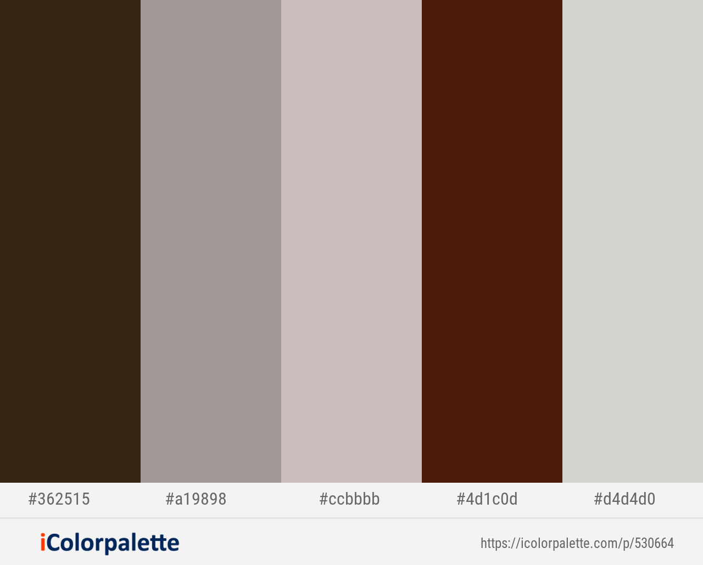

# **Explore Safaris**
[View live version of website via GitHub Pages](https://franciskadtt.github.io/voyager/)

**_Explore Safaris_** is an interactive safari application built with HTML, CSS, and JavaScript. The main users of the application are tourists who plan to visit safaris in Botswana or anyone who could be interested in browsing the application to find out more information about safaris and which places they can explore.

Botswana is a landlord country in Southern Africa. It is bordered by South Africa to the south and east, Namibia to the west, and Zimbabwe to the east. The country is roughly the size of France, yet over 40% of it is protected and conserved for wildlife. This is why the Botswana safaris holidays are unique, so you should absolutely try Botswana Safaris.

*WHAT IS A SAFARI*: 
In the broadest sense, to go on safari is simply to travel. More especially, A SAFARI is an exciting and adventurous way of seeing the ‘real Africa’ because it enables you to view a variety of wildlife in their natural habitat. As a result, going on a safari gives you an authentic experience of Africa. The purpose of a safari tour is to allow you to get intimate with the landscape and scenery. Safaris can involve walking through the wilderness, game viewing by 4x4 safari vehicle, boat, canoe, or small plane, to name a few.

## **The business goal of the website are**:
* Excellent UX to keep the users interested, and engaged and help build the brand.
* The website is responsive on all device sizes, giving the user more options where they can view the site without any issues, for example, the site can be viewed on desktop/laptop, iPad, or mobile.
* To keep the content relevant with no unnecessary and overwhelming information.
* To put Botswana safaris on the map and attract tourists to visit.
* The site is built on a mobile-first design, users can smoothly access the website from their mobile devices

The customer goals of this website are:
* to find what places they can go to for safaris in Botswana
* To easily compare the Okavango Delta and the chode National park and decide which safari
they would like to visit
* To easily navigate around the website and find the information they are looking for
* To easily view the site from their mobile devices wherever they are.
## UX
#### Ideal client
##### Potential visitors to the website could be:
* Tourists who want to go on safari - It could be tourists across the globe, who have never been to a safari before, or who liked their first safari tour and would like to see more places.
* Batswana people who are interested in wildlife and nature - It could be local people who like wildlife, and nature and want to explore safaris within their own country.
* School tours - Schools can arrange tours to teach students about wildlife and nature as part of their studies.
* Other potential visitors to the website could be anyone browsing the site and potentially decide
to visit one of the places. 
##### Visitors to this website are searching for:
* Safari places to visit based on their interest
* Variety of habitats, wildlife, and scenery to see
* Accommodation and restaurants available
* Guidelines on the best time to visit and weather
* Mode of transport used for various adventures
##### This project is the best way to help them achieve these things because:
* Most website contains overwhelming and unnecessary information to the user, such as advertisements and too many links.
* Some websites have poor UX design.
* This website is: 
    * The website has clear and simple navigation for the user to find what they are looking for intuitively.
    * Excellent UX to keep the users interested, and engaged and help build the brand.
    * The content is relevant and has no unnecessary and overwhelming information. 
    * The website is responsive on all device sizes, giving the user more options where they can view the site without any issues, for example, the site can be viewed on desktop/laptop, iPad, or mobile.
    * Easy way to contact site owner for suggestions.

#### Users stories

* As a user I want to visit a website about safaris in Botswana so that I can explore the site and maybe visit the places.
* As a user I want to see the menu bar so that I can easily navigate the website.
* As a user I want to see animal slider images, with brief information about the Okavango Delta and Chobe National park so that I can have an the idea about the places.
* As a user I want to see an introduction about Botswana safaris and an image so that I can have a better understanding of safaris. 
* As a user I want to see places to explore available in Botswana safaris so that I can have an idea and information when I prepare myself.
* As a user I want to see images and content on each place to explore so that I can have ideas on what to expect.
* As a user I want to see the Botswana map with pinpoints of the Okavango Delta and the Chobe National Park so that I can see where they sit on the map of Botswana.
* As a user I want to be able to click on any of the images/names of the places so that I can be go to their repective page depending on which image the user clicked on.
* As a user when I click on the image/name of a particluar place to explore, I want to see the animal's image banners so that I can have a feeling about the place and what to expect.
* As a user while I am on the places to explore section, I want to see an introduction about the Okavango Delta and Chobe National Park for more information.
* As a user I want to see information about the best time to visit, best weather and high season so that I can keep that in mind when planning for my safari trip.
* As a user I want to see images/content about the place, lodges and camps so that I can have more information.
* As a user I want to see what type of accommodation is available so that I can decide what type of lodgement I would like and if, I need to carry any camping equipment.
* As a user I want to see what wildlife is found in a particular place, so that I can know what wildlife is found in the Okavango Delta and the Chobe National Park.
* As a user I want to find out what type of wildlife is either common, abundant or rare in places to explore so that I can choose which place I want to start or go to.
* As a user I want to compare the Okavango Delta and the Chobe National Park so that I can decide which place I want to explore more.
* As a user I want to see the contact information on places to explore so that I can send an inquiry if I need more specific information or when I have a question.
* As a user I want to see a map showing restaurants, accommodation and Game reserves found in the Chobe National Park and the Okavango Delta for extra information.
* As a user I want to see the social links of Botswana safaris so that I can follow them.

### **Design**
As the central theme of the website is safari, I made all my design choices based on earthy colours & elements.
I researched websites of safaris, to get inspiration for the colour scheme.

#### Fonts
I used [Google Fonts](https://fonts.google.com/ "Google Fonts") to explore the various options.
For the overall content I have decided to use the [Merriweather](https://fonts.google.com/specimen/Merriweather?preview.text_type=custom&query=me") Google fonts: Merriweather") font. This font is pleasant to read on screens.

#### Icons
I used icons from [Font Awesome library](https://fontawesome.com/ "Font Awesome"). The icons that were used were are all nautical themed or used to give meaning to a certain section.
I used icons from [flaticon](https://www.flaticon.com/). "Font Awesome").

#### Colours
The colour scheme is based on nautical and sailing colours. I wanted it to feel modern and clean. I used [Coolors](https://icolorpalette.com/) to map out my colour scheme.

Colour Palette:

### Wireframes
Links to the wireframes are listed below:
* [landing page(mobile)](assets/wireframes/mobile.pdf)
* [Explore page(mobile)](assets/wireframes/mobile-explore-chobe.pdf)
* [landing page(desktop)](assets/wireframes/desktop.pdf)
* [Explore page(desktop)](assets/wireframes/desktop-explore-chobe.pdf)
* [landing page(ipad)](assets/wireframes/ipad.pdf)